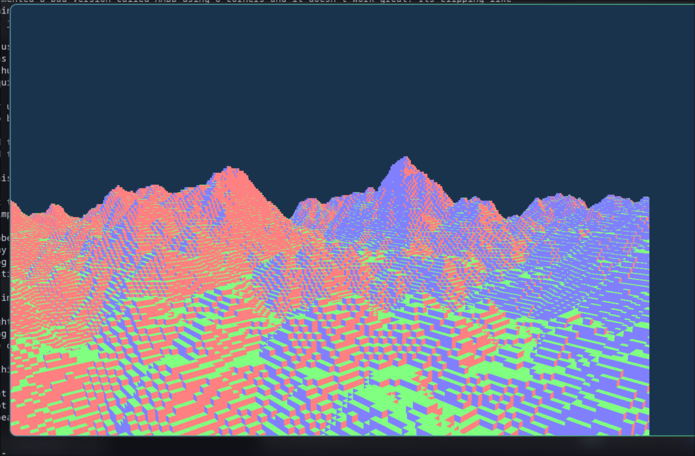
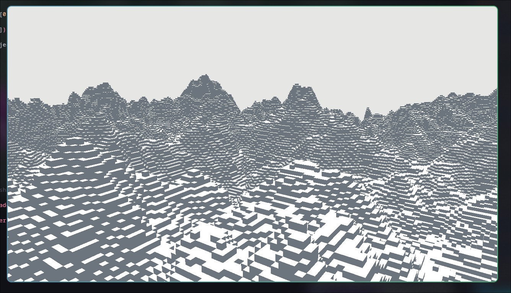

# Journal
Journal to keep track of my progress.
## September 23rd, 2026
I want to make more 3D apps but don't want to become a web technology person bc I don't like JS.
There aren't many altenratives out there, I did some research and they all seem to be really dated.
I mean 3D engines like unity are great but the lag my computer so hard I can never use them.
I need something that makes it easy to render 3D objects without forcing me to worry about OpenGL.

### learning
I understand the 3D pipeline pretty good in terms of software rendering contexts, but know nothing aobut GPU rendering.

I did some research and here's the general flow:

 - Create vertexes and upload them to a VBO
 - Send them to a vertex shader, which runs for EVERY vertex. In this case it can do the perspective transformations
 - Tell the GPU to render it 
 - GPU calls fragment shader for each pixel that is "in the triangle". Return its color.
 - Fast because fragment and vertex shaders run in parallel.

### implementation???
To not waste my time with OS specific stuff I just decided to use GLFW and GLEW for GL extensions.
I'm gonna try to render a triangle now.


Just wasted so long to learn i needed 
`glewExperimental = GL_TRUE;`

Nvm that didn't work. Time to use GLAD.

### matricies
Ok so to my knowledge of 3d graphics, its not that hard to get perspective
given x, y, z, return x' and y' such that x',y' represents the 2D projection
of x,y,z

```
x' = x/z
y' = y/z
```
I used this technique a lot during software rendering, but this doesnt fly
in real graphics programming. They use matricies instead.

Matricies are calculated on the CPU, and then pushed to the GPU, where
the vertex shader takes them and uses them to move the point relative to
the cameras perspective, rotation, etc.

This wasn't hard to setup because the GLM library does all the hard math for you.

### Input
GLFW provides some input hooks I believe. I'm going to implement camera controls using them.
`glfwGetKey`

This was really easy to set up. I don't think FPS will be an issue, but if someone on a
supercomputer might travel at Mach 5 due to the hard-coded offsets.

```cpp
glm::vec3 direction;
direction.x = cos(glm::radians(yaw)) * cos(glm::radians(pitch));
direction.y = sin(glm::radians(pitch));
direction.z = sin(glm::radians(yaw));
```

I know its not ideal rn to use "look at", when i do have a direction matrix but who cares.

### textures
Textuers rely on UV coordinates, which are xy pairs from 0 to 1. We need to add a UV coord
to each vertex.

```cpp
float vertices[] = {
        -0.5f, -0.5f, 0.0f,   0.0f, 0.0f,   // xyz, ux,uy
        0.5f, -0.5f, 0.0f,    1.0f, 0.0f,
        0.0f,  0.5f, 0.0f,    0.5f, 1.0f
}
```


Since we addedd allat, we can modify our input VAO explainer. We just change increment to
5 that way it skips over UV coodinates. We also want to add another VAO just for UV coords.
I'm starting to understand it now. VBO is raw bytes, VAO is a map to the bytes for the GPU.

Next I took in the input in the vertex shader and just pass it to the fragment shader.
This means our vertex shader outputs something, in this case, uv coords.

```glsl
#version 330 core

in vec2 uvCoord;
out vec4 FragColor;

void main() {
    FragColor = vec4(uvCoord.x, uvCoord.y, 0.0f, 1.0f);
}
```

This should hopefully work.
I see a beautiful UV triangle. Well now i have to somehow map an image on it. Fah.

So basically the shader just uses a magic lookup func that returns a colo value,
we still gotta use opengl to like well upload the texture.

Also added something right before draw that tells opengl to bind that texture

## September 24, 2026
```cpp
#include "rendrx/Scene.h"
#include "rendrx/Triangle.h"

int main() {
    rendrx::Scene scene;
    rendrx::Triangle tri = {{-0.5f, -0.5f, 0.0f}, {0.0f, 0.0f},
                            {0.5f, -0.5f, 0.0f},  {1.0f, 0.0f},
                            {0.0f, 0.5f, 0.0f},   {0.5f, 1.0f}};
    scene.addTriangle(tri);
    scene.launch();

    while (!scene.shouldClose()) {
        scene.render();
    }

    return 0;
}
```

It's refactor day! I came up with my "ideal usage" and then started creating files.
After like 17 minutes of work I got all the header files done. I reused the
Vector3/Vector2 classes from previous projects for simplicity.

51 minutes in, I have a Scene.cpp class and I've porrted most of the code over copy paste. Now
all that's left is the render loop. I changed pitch and yaw for camera rotation to use glm:vec3
Wait. GLM has a vector3, why did i make a vector3 class myself. Smh. Ok well thats for a later 
refactor.

Ngl. the build system failed to compile my vector3 class, its probably an easy patch, but im lazy.
Lets just switch to GLM ig. Well I can't avoid it, turns out i configured CMAKE wrong. Had to add
CONFIGURE_DEPENDS:

```cmake
file(GLOB_RECURSE SOURCES CONFIGURE_DEPENDS
    src/*.cpp
)
```

Alright. I just got it to compile, and nothing showed up on my screen. Great. Debug time.
Turns out the mistake was forgetting the minus sign in `-90.0f` yaw. Waste of time.

### cubes n stuff
I wrote up the coodinates for a cube made of 12 triangles, two per face by hand, and then rendered.
As expected, it created a really weird look, likely because the order of rendering is cooked.
This is probably because I'm rendering triangles that are behind the front of the block last,
which probably screws everything up. I'm gonna do some more researcch on this topic.


### Backface culling
So basically things behind you are a different rotation in terms of A B and C than things
infornt of you. Its hard to explain without images but the math works.
```cpp
glEnable(GL_CULL_FACE);
glCullFace(GL_BACK);
glFrontFace(GL_CCW);
```

And since I from the start wrote the coorrdinates in the correct order (prob cuz i stole
them from a prev project). It worked perfectly. 

### More primatives
Right now I only support triangles, but that's going to become an issue. The solution 
is to make an abstract class/interface that has a comprerssion featuer that turns it
into a vector of floats in the p1p2p3uxuv format.

I'll begin.


It took a little longer than usual for me since I forgot basically everything about 
abstraction in C++ after writing Java for a month, so I had to rewatch some videos.
Eventually, I got it to work with the new Object system.

I'll make a QUAD primative now. It's pretty simple.

Quad primative simplyy takes in 4 points and generates 2 triangles when it flattens.
This project lwk is evolving into a minecraft clone ngl.....

## September 25th, 2026
I want to get a couple things working to keep this engine good for the future. First,
I want to get multiple textures loading. Currently, the top of the cube is the same
texture as the sides. Same with its bottom. I need to figure out how to switch textures
for different objects.

### textures
I read the code that hanldes texutres and its pretty simple.
Basically the main part thats important is this:

```cpp
glUseProgram(shaderProgram);
int textureLocation = glGetUniformLocation(shaderProgram, "texture1");
```
We pull out the location in the shader of where the input "texture1" is.

Then, we say 
```cpp
glUniform1i(textureLocation, 0);
```

This basically tells opengl to bind that texture location to 0. 
Recall in our draw loop:
```cpp
glActiveTexture(GL_TEXTURE0);
glBindTexture(GL_TEXTURE_2D, texture);
```

Our shader is configured to read from 0, and we set 0 to the texture.

Originally, my thought was to just change what GL_TEXTURE0 means by swapping
the texture int it poitns to. But this is really slow, also would break my
refactoring of the draw loop taking in flattened triangles only.

Turns out, theres a simple solution, the texture atlas.

I basically imported a large minecraft atlas, 512x512, and now,
instead of setting uv coords to like 0 to 1, i can do like 0 to 1/(row len)

I hard coded the UV tiles real quick, just to see if it works.

And voila, a nether wart cube. Well let's try to find a different more useful
block.

```cpp
constexpr float u0 = 0.0f;
constexpr float v0 = 0.0f;
constexpr float u1 = 32.0f / 512.0f;
constexpr float v1 = 32.0f / 512.0f;
```


All I have to do is tinker with these values till I get something useful
```cpp
constexpr float x = 0;
constexpr float y = 0;
constexpr float u0 = x * 32.0f / 512.0f;
constexpr float v0 = y * 32.0f / 512.0f;
constexpr float u1 = (x + 1) * 32.0f / 512.0f;
constexpr float v1 = (y + 1) * 32.0f / 512.0f;
```

Using this neat formula, I can cycle through blocks. It was looking really
weird though. I just realized. It's because the image is 512x256 not 512x512.

I changed the formulas to reflect. It looked like it was showing me 4 blocks.
I just divided everything by 2 and it worked. Smh. 

Anddd it didn't. Turns out textures are 10x10 not 16x16 or 8x8. I hate this.

Ykw this sucks. I'm switching to a 256x256 atlas. It works now.

### period 3 at school time
I decided to wrap this sketchy atlas code into a helper.


This took way too long, since I added a new constructor for Quad that just
takes in 3 points and a pair of two UV coordinates for the bottom left and right
aka the same format that the atlas helper returns.

### next steps for the project
Lwk realized making minecraft might be a easier, and more finishable project.
Voxel engines are pretty simple. You have a Chunk class, that holds blocks, 
then you loop through each block in a chunk, checking its neighbors, to then
selectively decide what quads to add to the object list, then render.

I don't really know anything about updating objects in the VBO yet.
Let's just focus on getting the block system to work for now.

I created the block class and I'm going to see if I can use its abstractions.

### blocks
After a traditional segfault (i tried to move a pointer I already moved),
I got it to work.

```cpp
auto uv = rendrx::getUV(3, 15);
Block block({0, 0, 0}, uv); // block at origin

scene.addObject(block.getFront());
scene.addObject(block.getBack());
scene.addObject(block.getLeft());
scene.addObject(block.getRight());
scene.addObject(block.getTop());
scene.addObject(block.getBottom());
```

Although the current way I'm doing uv is not the way I want to do it,
for now this is fine.

## September 26th, 2026
I wan't to get face culling and chunking done today. This basically means i don't
render blocks whose face is covered by another block.

I'll start setting up a chunk class.

Well that worked. I had to add an isAir property and a default constructor, but
after a segfault or two, I got it to work. Next step is to stop rendering mutual
faces.

### culling
If you neighbor is air, then only render the face, othherwise its covered and
is useless. this took a while to implement, had to enable polygon mode

```cpp
glPolygonMode(GL_FRONT_AND_BACK, GL_LINE);
```

The bug was me gettting my + and - wrong for Z.

It works but there's a weird effect when I get close. Oh wait i turned off
backface culling. Re-enabling it made everything work.

### QoL
 - I made WASD relative to the camera
 - I made the initial camera position and rotation better
 - Press `p` to toggle polygon view

Next steps:
 - enum blocks that have different textures per face
 - infinite chunking
 - terrain generation

## September 26th, 2026
I want to get infinte chunk loading done today. This means that as the player goes about,
chunks unload and load.

I implemented a system that allows chunks to have chunk coordinates. I put two chunks 
together, and got this weird visual issue. Wait, thats prob because the face culling
between chunks doesn't work. Let me reseach.

### World class?
I could use a world class that holds all chunks and make everyone use world.get, but
that would sort of cause issues with unloaded/loaded chunks. Though I was going to make
a world class anyways. Hmm. Well if chunks are unloaded then its not really an issue really.
Since they aren't loaded they can't make a weird visual error.

Added a world class, with a block finder, that uses integer division floored to find the
chunk. It will error if someone tries to reach a block that doesn't exist but who cares.


Wait, i'm dumb, my code will of course do that. Uhhhghghghgh. Let me make a patch.

I just check if its out of bounds, if so I just return air.

### Cycle out terrain at will?
Right now, the system uploads meshes to the VBO, ONCE. Then never again.
I need to research how to update it.

I'm considering giving each chunk its own VAO/VBO. This will destroy the line between
rendrx, and the minecraft clone, but honestly, at this point, a mc clone is what I really want.
Rendrx is now a VOXEL engine.

Current pipeline
```
World.generateMeshes(&Scene) -> Chunks -> Block -> (culling) -> Quad -> Scene.addObject(Quad) -> Quad.flatten() -> VAO/VBO
```

Target pipeline
```
world.generatemeshes(&scene) -> chunks -> block -> quad -> quad.flatten() -> vao/vbo

friend classes so scene can access private member: chunks

scene -> addworld(&world) -> chunks -> chunk.draw()
```

### Implementation
This is going to take a while I asssume....

Yea I can't even descrribe how locked in i was, i didn't take anyy notes

I did segfault, but I know why. I'm instantiating the vao/vbo in the constructor before a context was opened. whoops

```gdb
Program received signal SIGSEGV, Segmentation fault.
0x0000000000000000 in ?? ()
(gdb) bt
#0  0x0000000000000000 in ?? ()
#1  0x0000555555557ab5 in rendrx::Chunk::Chunk (this=this@entry=0x7ffff75b7010, chunkCoord=..., chunkCoord@entry=...)
    at /home/ahsan/repos/rendrX/src/rendrx/Chunk.cpp:15
#2  0x0000555555559d7e in std::make_unique<rendrx::Chunk, glm::vec<2, int, (glm::qualifier)0>&> ()
    at /usr/include/c++/16/bits/unique_ptr.h:1104
#3  rendrx::World::loadChunks (this=this@entry=0x7fffffffd2e0, position=..., position@entry=..., radius=radius@entry=5)
    at /home/ahsan/repos/rendrX/src/rendrx/World.cpp:17
#4  0x0000555555556a96 in main () at /home/ahsan/repos/rendrX/src/main.cpp:9
(gdb)
```


OMG IT WORRKED!!
Dude I can not express how complex this refactor was, but I managed to pull it off by just limiting my overthinking.
It really did work though. I just moved the opengl context creation into the constructor of Scene instead.


### Docs
 - Create a scene, which initializes glfw and glad
 - Create a world
 - load chunks in the world, generating chunks, chunks also initialize their vao/vbo
 - compile chunk into meshes (quads)
 - Add a world to the scene (its a reference)
 - launch scene, which goes to each of the world's chunks internally and tells them to upload triangles
 - run infinite loop
 - scene.render goes to each chunk and runs .draw()

### Main objective: Chunks loading and unloading
Easiest way to do this is to detect when a player crossees chunks, and do the following
 - re-run loadChunks (make sure its map aware and doesn't regenerate alr loaded chunks)
 - go through chunk list and terminate all not in radius
 - re run generation?
 - refactor so generateMeshes also uploadsTriangles so that Scene doesn't do it ever
 - buisness as usual?

Detecting chunk changes is interesting. Let me see. Right now we use cameraPos as playerPos.
Need to think.... We can use a prev position perhaps.

I needed to make a way so that people can see camera pos but not edit it. Turns out const references are a thing.
I really do need to brush up on my CPP knowledge and re-read cpp primer again. One day.


### done
I added an unloader, that just goes through each chunk, calcualtes tthe disttance from the player, and then
just checks if thats outside our render distance, if so it errases it. Since its a smart pointer, it
deallocates it for us!! :)

### World Generation
I've heard a lot about perlin noise online. Let me see how to use it.

I implemented a perlin noise class pretty easily. I'll shove it into terrain generation next.

I got it all setup, but rn i'm genuinely getting about 20fps at 8 chunks. I don't know who to blame.
There are many things that can be optimized, perhaps block is too heavy, perhaps my perlin impl. is 
trash. I don't really know.

Found it. For every block, I instantiate 6 quad objects on the heap. Even though MOST of them, will
never ever be rendered. Lets just switch it so that they are instantiated when requested for instead.

This made it better, but the entire system still freezes for 0.2 seconds ish on chunk load.
I could work around this using multithreading, or look for more solutions.

Wait honestly, it isn't that unoptimized or laggy, just i'm blocking the entire game to load chunks.

I originally just added a queue and then, I realized it was laggier than before. That's cuz I kept
putting items that were already in the queue in the queue again, because the worker didn't get there.

turns out it was working great? it seems to be 
`// world.generateMeshes();`

Commenting it out made frreezing stop, and chunks load in under a milisecond each.
```
Initializing
Generated chunk (-8, 1) in 0.977291 ms
Generated chunk (-7, 4) in 1.06209 ms
Generated chunk (-6, 6) in 0.54539 ms
Generated chunk (-5, 7) in 0.420052 ms
Generated chunk (-4, 7) in 0.435926 ms
Generated chunk (-3, 8) in 0.498631 ms
```

Lets see generateMeshes. Ah. It regenerates meshes OF ALL CHUNKS. no matter if they didn't change.
Let's just make it generate chunk by chunk instead.

This is much better, though now the W key makes you go slower when chunks are loading. This is of
course due to the fact I append position by frame not by deltaTime.


WOW!!!! with delta t its so good. this is actually high fps.
Let's try to add an fps counter actually. It hovers around 70 fps normally, dropping to 55 at worst
on 8ms chunk loads. I'd call that a success

### Better terrain gen
Rn i'm just doing one layer of perlin noise, the better way is to use layers of it called octaves at
different frequencies. AKA FBM (Fractal brownian motion)

Side Quest: make height 256 possible. Rn its at like 0fps.

Optimization list:
 - add depth test 
 - fix vertex shader overcall bug i found
 - fix the fact each chunk builds its own perm[512] on its own every time
 - spammy printouts may bottleneck

I got it up to like 20-30 fps on 256 height now. I can make this better by doing the perm[512] thing.
Its actually 60 fps, but it drops to 30 on chunk creation. My target should be improving chunk creation.

That helped but:
```
FPS: 60.6674
FPS: 59.5038
FPS: 57.5445
FPS: 21.5437
Generated chunk (-8, 10) in 22.3248 ms
FPS: 43.4409
Generated chunk (-7, 13) in 41.372 ms
FPS: 23.7063
Generated chunk (-6, 15) in 38.8194 ms
FPS: 25.3304
Generated chunk (-5, 16) in 23.8186 ms
FPS: 39.6947
Generated chunk (-4, 16) in 57.5861 ms
FPS: 17.0917
```

It's still really bad. One thing we can do, is consider if Block class is even useful.
What if instead, we just held an enum stating what kind of block it is? Then, instead
of storing block coordinates, we'd just have a list of those enums for all 16*256*16 
blocks of our chunk.

On render, when we do b.getSide, b.getFront, we could instead just generate the block
on the fly THERE.

I'm going through some intense debugging rn. I can't figure out what I did, but nothing renders now. 0 Clue.


I still have 0 clue, I can't figure this out at the moment. It's just not making sense.
I held down w and span the camera around and i saw flickers of blocks, sometimes a tower.
Its just so broken, idk why. ive test.

one thing I can think of is the fact that by deffualt before it was air, now its uninstantiated
in the array. maybe thats something to think about.

YESSS IT WORKED
OMG
AND ITS AT LIKE 120 FPS
OMG


FInally1!
Yea its a day
gn


## September 28th, 2026
I want to implement some overall fixes. Rn blocks are just one face, so let's solve this with a 
constexpr 2D array between Blocks+faces to a uv pair. I realize now how inefficient some aspects
of this codebase is. Like why on earth is getUV a glm::vec2 function. Its literally taking in 
2 unsigned integers, that will never be greater than 256. uint_8 is a better tool

Its working quite well. Let me add more blocks now based on the texture atlas. Brb.

It works fine. I also noticed the texture image i used has no top grass block lol.
This is fine for now, I just used green wool. Other issues: textures don't look good?
I don't really know how that could be but, I can just try using a higher quality atlas.

Yea that's not happening. Lets try something else more useful like getting stone and dirt
heights configured.

That looks not that good, but its good enough for now. 

### Multithreaded Chunking
I need to add a way so that other threads can deal with chunks. I don't know much, but
I think one other thread is fine.

I was using a system with mutex's and chunks, but now I realize I need like one thread.
There goes all my work. Oops.


Hit a roadblock. If a thread runs generateMesh(pos);, it also uploads chunks to opengl, in a thread.
this is not allowed since thread doesn't have opengl context. What if insetad i just don't upload..
Then I can use the main thread to upload instead. Should be fine.

I got it to work, but nothing shows up. chunk gen is working though. This mutex stuff is hard.

I think I see the issue, its because chunk instantiation, results in the creation of a VAO/VBO.
If i do this on a thread, where there is no opengl context, it does nothing. One idea is to just
move creation outside? Uhhh well, that's interesting to say the least lol. It works, but its glitchy?

### sike
I think its because im popping it from queue before generation, causing requeueing
i fixed it, it doesn't freezze no more. still prob unsafe and sucks on higher terrrain gen loads.
gotta figure ts out eventually
At times its verry fast, but then it freezes up?
I have not much knowledge on thread safety. Gn

## September 29th, 2026
Watched some videos on mutex's and thread locks. The plan as is as such:

If pos not in chunks, and its not in chunksQueued:
    push to buildQueue
    push to chunksQueued

Worker thread:
    pop from buildQueue
    generate
    push to finishedQueue
    pop from chunksQueued

I got this by simply changing some things. Now time to see if it can handle a million threads.
The game randomly freezes and locks up. Idk why

I think I know why. Its cuz I instantiate chunk in place with chunk[pos] every time. This is
dangerous. I don't want to use a mutex either because that's also not smart to lock everyone
out of an important array.

I ended up changing the system so that it pushes chunks to a finished queue before its then 
pushed to the chunks in the main thread, thinking that would make it thread safe.
Well turns out pushing and removing data from an unordered map, while the thread is using
get_block, which reads from the unordered map using find, leads to segfaults. This is kinda
stupid though, since the majority of the calls for getBlock literally go to read blocks
IN ITS OWN CHUNK. Let me bring back chunk.getBlock.

Lets actually start by abstracting world generation code away from just chunk.
Ok that took a bit too long, but now I should be able to do a block gen from
the literal worker thread.

Ok. It works great now. Only issue is that there is a block of void between chunks.

Not a block of void, but just missing faces in general. let me investigate.
Need to debug this. found it. its because i changed a y <= to a y< in the latest version.
fixed.

I tried some stuff out, added a sand block, but am still unsure where to go with this terrain generation.
Perhaps something better to do with my time would be to well, focus on what's more important:
 - MOAR RENDER DISTANCE

I want to have insane render distance, like those achieved with mods like Distant Horizons in minecraft, using
LOD chunks, level of detail.

Firstly though, the textures look TRASH. Let me see why. Found the issue in Quad.cpp. I had my UV coordinates wrong.
Whoops! Also, I searched online about opengl smoothing/blurring low quality textures, and turns out that was an easy fix
too.

### i am inevitible
I've been avoiding it, but its going to happen eventually. I need to actually program the lighting system.
There are many ways to do this, some use differed rendering, which is optimal, some use sketchy tricks to
guesstimate shadows, and some use raytracing to calculate shadows. I don't really know what I'm going to do.
Ykw, lets just focus on render distance. Ill increase it till i can't anymore.

I upped it to 24 chunks and it got to like 30fps, but with messages that read out 131 fps in between??
I have no idea where this could even come from.

```FPS: 145.061
FPS: 38.9176
FPS: 131.409
FPS: 39.7466
FPS: 40.6008
FPS: 195.666
FPS: 40.0365
FPS: 49.8349
FPS: 38.0975
FPS: 123.529
FPS: 35.6295
FPS: 131.359
```

Let me try to see what I can optimize.

### ideas
 - frustum culling
 - get rid of stupid quad/object path
 - add a cache for those chunk border block check things
 - limit the amount of chunks sent in main thread per cycle to like 2.

## September 30th, 2026
did a poll on instagram on what to do. seems like everyone wants infinite render distance. let's program some more
optimizations now.

one issue is the uselessness of the quad class. its like 80 bytes, insttantiatetd on the heap, and literally cleared
out on every "uploadTriangles()" call. instead, lets just push the vertecies instead of quad creation.
this means we transfer the capabilities into the chunk.add_face() section of the code.

I changed it so thatt chunk now creates the verticies in place and doesn't use the quad class.
This should eliminate useless object creations. Honestly, idk how much of a difference that made.
It's hard to benchmark due to bad FPS counter.

Let's fix the FPS counter. It works. Now let me try inceasing render distance.
Going from 140 ish fps at 12 render distance to 70 at 18 render distance is not good.

I need to consider doing frustum culling. I've heard its great for reducing gpu load.

I implemented a bad version called AABB using 8 corners and it doesn't work great. Its clipping like
everything, including things right infront of me for like 5 chunks. I'm too lazy to fix this,
so lets just use a proper frustum plane check. I took the projection indecies off of learnopengl.com.

I was just about to say, man this FPS boost ins't that good, its still 144fps. Then I realized.
That was on 18 chunks!!!! So it did in fact work. From 60 to 100-140 is amazing. Raised it
to 24 chunks, now i'm still at 140s fps. Lets see if I can handle 32. It got down to 80 but, it's
doing quite well. 

Another unoptimized thing is the draw loop. I'm running things like opengl calls that only
need to be called once.

I moved the projection/model/view matricies lookup out into the constructor. Let's see what else.
I moved the rest of the enables and one time things.

This raised fps by about 5 to 10 I think.

I think the next best thing to go for is LOD (level of detail). Basically, for chunks hella far out, we can set them up to 
just simplify and lets say be only 8x8 blocks, but take up the full space of a 16x16. Let me read about this.

## October 2nd, 2026
Broke my streak yesterday due to bordem and motivational rut. Lets get back to work. The first thing I want to implement
is a fog effect. All I need is the position of the fragment. I modified the vertex shader to pass it on. Let's see
if it still builds.

Got it implemented. Works kinda well, needs to be adjusted by render distance.

### Lighting
Lighting works by taking the angle between a ray from the fragment to the light source and its normal.


To do this, I need to pass normals into the vertices, into the vertex shader and passed into the fragment shader.

Uhh that ended up with the weirdest graphical glitch, all textures are red and shit. 0 clue lol. Found the bug.
I forgot to change the stride(increment) from 5 floats to 8 floats. It works now all fine. Turned on normals.
Looks beautiful. Should probably screenshot ts more lol.



Ok let's continue. dot product of two vectors divided by their magnitudes multiplied together = cos of the angle between them.
You could run arccos() on the left hand side, but genuinely that does nothing much of importance, and is a wasteful
calculation. But since we have some number that scales from low to high depending on how close to perpendicular something is, 
we can scale lighting.

These fragment shader bugs are mad annoying. I'd really like to be able to have an LSP tell me how many idiotic semicolons/misepllings
I got wrong. Hemispherical lighting is cool, but not cool enough. I added a sun direction input into the fragment shader, passed it
in from the cpu. Lets see what I can code up. I added a sun that takes in sunLight and sunDirection, using dot product products.
After changin the specs it should work.


Uhh wtf hackatime just forgot the entire hour of work i just put in. 

### differed rendering
lets render a normal image and a depth image to a texture and then use that instead, also makes gl_depth test work better without expensive
lighting calcs being wasted on obstructed pixels.

I didn't jounal much but its getting really complex. This needs refactoring.

Weird ahh bugs:




YES! It works. This took so long. this took way longer than 58m but hackatime broke.

### bring back fog
Let's bring back fog. Shouldn't be too hard. I added it back. Also added camerapos as a uniform.

This code is quite messy, a refactor is due eventually.
