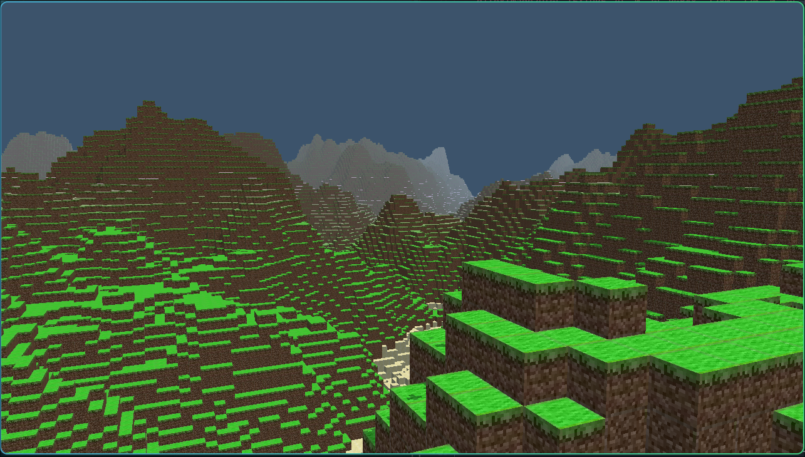

# rendrX

A minecraft clone written from scratch in C++ using OpenGL and GLFW for windowing & KBM input.

## Let's play!

### Releases
Use the releases tab and download the correct one! Linux on x86 only (for now).

### build
Have an unsupported OS/arm machine? Build from scratch. Clone the github repo and run the following.

Ensure CMake, GCC, and GLFW are installed.
```
cmake -B build
cmake --build build
./build/rendrX
```

### Controls
Use WASD to fly around. Left shift and spacebar for vertical translations. Use you mouse or the
arrow keys to pan around. Use number keys 0-9 for different block selections.
Left mouse to break, right mouse to place

## Technical

### Features
 - Frustum, Backface, and Neighboring face culling
 - Differed rendering
 - Ambient & Hemispherical lighting
 - Shadow mapping with PBR for smoothness
 - Infinite terrain generation
 - Multithreaded; uses `std::thread` for cross platform threading. Used by terrain generation.

### Credits
I used AI in this project for researching different methods for rendering, as well as used Opencode once to explain a compilation error to me caused by a bad CMakeLists.txt. The vast majority of this code is handwritten by myself.

I also sometimes took code samples from learnOpenGL.com as well as Wikipedia. See `JOURNAL.md` and code comments.

```
// Look at the triangle at origin ALWAYS
    glm::mat4 view = glm::lookAt(cameraPos,                  // pos
                                 cameraPos + direction,      // direction
                                 glm::vec3(0.0f, 1.0f, 0.0f) // up
    );

```

PSA: Not all comments that are aligned perfectly are LLM slop lol, autoformatters exist and are awesome (neovim user)
